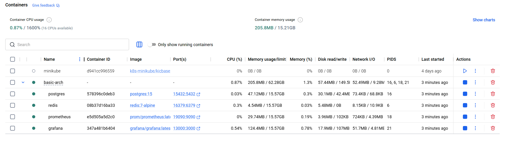
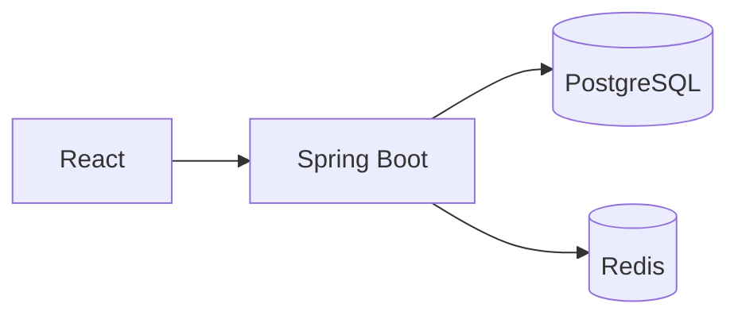
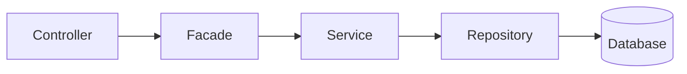
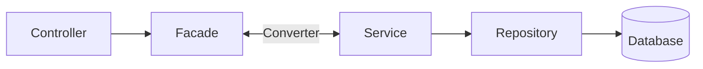

# todolist

---

## 1. 소개

#### todo-list 토이프로젝트, `기간 2주` 시작일 지정안됨

현 프로젝트는 간단한 todo-list를 구현하는데 주된 목적을 가집니다.

- [todo-list-backend](https://github.com/Kimjiman/todo-list-backend)
- [todo-list-frontend](https://github.com/Kimjiman/todo-list-frontend)

### 개발자

| 이름  | 역할 | GitHub                                    |
|-----|----|-------------------------------------------|
| 김지만 | 미정 | [toyriding](https://github.com/Kimjiman)  |
| 박찬우 | 미정 | [Swhite214](https://github.com/Swhite214) |

### 기술스택

| 분류       | 기술                                        |
|----------|-------------------------------------------|
| 언어 / 플랫폼 | Java 21, Spring Boot 3.5.9, Gradle        |
| 데이터 접근   | Spring Data JPA, QueryDSL, Flyway         |
| 매핑       | MapStruct, Lombok                         |
| 인증 / 보안  | Spring Security, JWT (jjwt)               |
| 캐시 / 세션  | Redis 7 (토큰 저장소 + 캐시)                     |
| 데이터베이스   | PostgreSQL 15                             |
| API 문서   | SpringDoc OpenAPI (Swagger UI)            |
| 로컬 인프라   | Docker Compose (PostgreSQL + Redis 자동 기동) |

## 2. 실행 가이드 및 프로젝트 세팅

요구 사항: JDK 21, Docker(Windows는 WSL2 필요)

| 프로필     | 포트   |
|---------|------|
| `local` | 8086 |
| `dev`   | 8080 |
| `prod`  | 8080 |

### local 환경 구성(window11기준)

1. 제어판 > 프로그램 -> windows기능 켜기/끄기 진입
2. 3가지 항목을 체크 후 확인

- Hyper-V
- Linux용 Windows 하위 시스템
- Windows 하이퍼바이저 플랫폼 켜기

재부팅

3. PowerShell 진입

```shell
   # 1. WSL 및 WSL에 Ubuntu 설치
   wsl --install
   
   # 2. WSL2로 고정
   wsl --set-default-version 2
   
   # 3. WSL및 LINUX 버전 확인
   wsl -l -v
   ```

4. [Docker Desktop 설치](https://docs.docker.com/desktop/setup/install/windows-install/) Docker Desktop for Windows -
   x86_64

위의 과정에서 설치가 완료되었다면, 해당 프로젝트만 구동하면 됩니다. 프로젝트 구동
시, [LocalDockerConfig](src/main/java/com/example/todolist/config/LocalDockerConfig.java)에서 프로젝트 인프라를 자동으로 세팅해줍니다.



---

## 3. 기능

### 프로젝트 아키텍쳐



### 기능 흐름



|                | 가능한것                                        | 안되는것                                            |
|----------------|---------------------------------------------|-------------------------------------------------|
| **Controller** | Facade 의존, 사용자 요청, 응답 반환                    | 검증 로직, 직접 Service 호출                            |
| **Facade**     | Service 의존, 입력값 검증, 예외 처리, 트랜잭션, 비즈니스 로직 조합 | Repository 직접 접근, HTTP 관련 코드                    |
| **Service**    | Repository의존, 단일 도메인 비즈니스 로직                | Repository 직접 접근, 예외, HTTP 관련 코드, 다른 Service 의존 |
| **Repository** | DB 접근, Query                                | 비즈니스 로직                                         |

### 프로젝트 공통 구조 - Base Class ###

| 클래스                                                                                    | 역할                                      |
|----------------------------------------------------------------------------------------|-----------------------------------------|
| [BaseService](src/main/java/com/example/basicarch/base/service/BaseService.java)       | 모든 Service가 구현하는 인터페이스. 동일한 메서드 시그니처 강제 |
| [BaseEntity](src/main/java/com/example/basicarch/base/model/BaseEntity.java)           | PK 체계 단일화, 생성일/수정일 이력 필드 자동화            |
| [BaseModel](src/main/java/com/example/basicarch/base/model/BaseModel.java)             | Facade/Controller 계층에서 사용하는 DTO 기반 클래스  |
| [BaseSearchParam](src/main/java/com/example/basicarch/base/model/BaseSearchParam.java) | 검색 조건 공통 파라미터 규격화                       |

### 공통 유틸리티

| 클래스                                                                                    | 주요 기능                                                 |
|----------------------------------------------------------------------------------------|-------------------------------------------------------|
| [StringUtils](src/main/java/com/example/basicarch/base/utils/StringUtils.java)         | isBlank/isEmpty, masking, lpad/rpad, regex, 포맷        |
| [DateUtils](src/main/java/com/example/basicarch/base/utils/DateUtils.java)             | LocalDateTime-Date-String 변환, 요일, 날짜 연산               |
| [CollectionUtils](src/main/java/com/example/basicarch/base/utils/CollectionUtils.java) | safeStream, merge, separationList, toMap, extractList |
| [SessionUtils](src/main/java/com/example/basicarch/base/utils/SessionUtils.java)       | SecurityContext Thread-Local에서 현재 사용자 정보 조회           |
| [CommonUtils](src/main/java/com/example/basicarch/base/utils/CommonUtils.java)         | HTTP 응답 직접 쓰기, JWT 디코딩                                |

### Entity / Model 분리

- **Entity** (`extends BaseEntity<Long>`): JPA 영속성 객체, DB와 직접 매핑하는 객체
- **Model** (`extends BaseModel<Long>`): Facade/Controller 계층에서 주고받는 객체
- **Converter** (MapStruct): 양방향 변환 (`toModel` / `toEntity`)

### 접속 정보

- Swagger UI: http://localhost:8086/swagger-ui/index.html

---

## 4. Development Convention

### A. Branch Strategy

- 협의필요
- | Branch | Usage |
          |--------|-------|
  | `main` | 배포 브랜치 |
  | `develop` | 개발 통합 브랜치 |
  | `feature/{기능명}` | 기능 개발 |
  | `fix/{버그명}` | 버그 수정 |
  | `hotfix/{이슈명}` | 긴급 수정 |

### B. Commit Message Rule

| Type        | Usage             |
|-------------|-------------------|
| `[Feature]` | 새기능               |
| `[Fix]`     | 버그 수정             |
| `[Well]`    | 기능 개선, 리팩토링       |
| `[Docs]`    | 문서수정              |
| `[Chore]`   | 빌드 설정 및 플러그인 변경 등 |
| `[Remove]`  | 삭제                |

#### 예시

- `[Well] Redis 포트 변경 및 캐시 이벤트 핸들러 인터페이스 추가`
- `[Fix] Dockerfile 프로필 변수 삭제`
- `[Docs] README.md에 배포 서버 railway 정보 추가`

### C. Code Style

- 모든 서비스는 반드시, [BaseService](src/main/java/com/example/basicarch/base/service/BaseService.java)를 상속받아야 합니다.
- 모든 Entity는 반드시, [BaseEntity](src/main/java/com/example/basicarch/base/model/BaseEntity.java)를 상속받아야 합니다.
- 모든 Model은 반드시, [BaseModel](src/main/java/com/example/basicarch/base/model/BaseModel.java)를 상속받아야 합니다.
- 모든 SearchParam은 반드시, [BaseSearchParam](src/main/java/com/example/basicarch/base/model/BaseSearchParam.java)을 상속받아야
  합니다.


- Facade Layer에서 (Request: Model->Entity), (Response: Entity->Model), MapStruct를 이용하여 컨버팅을 반드시 해야합니다.
- Service에서 다른 Service의 호출은 금지됩니다.
- 트랜잭션은 Facade Layer에서 실행됩니다.

### D. PR & Review

---

## 5. Claude Cli

해당 프로젝트에는 Claude Code의 도움을 받기 쉽게, Claude용 설정 파일이 적용되어 있습니다.

- `/.claude/**` - Agent, Command, Rule, Skill 확장
- `.mcp.json` - 기본 MCP Connector
- `CLAUDE.md` - 클로드 planner 

---
